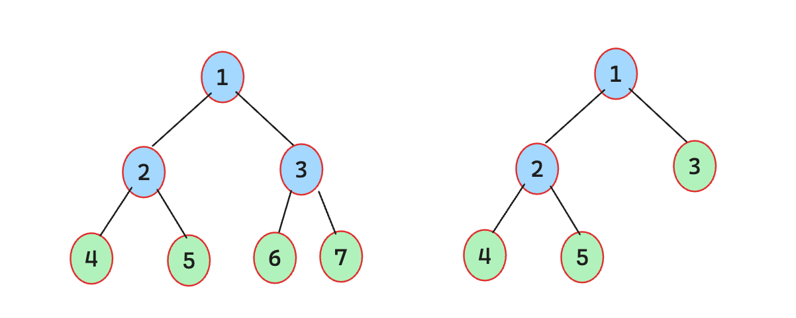
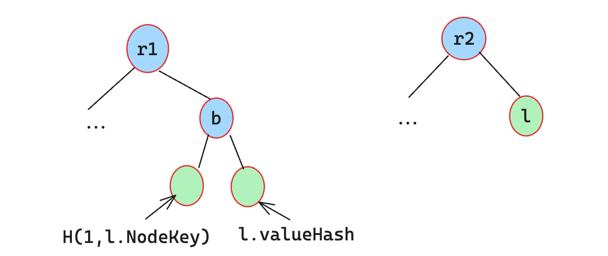

# Lack of Domain Seperation

## Introduction

In cryptography, domain seperation involves using distinct prefixes, labels, or keys in different context or for different purposes, ensuring that even if the same cryptographic algorithm and inputs are used, outputs will differ.

Without proper domain separation, systems become vulnerable to various attacks. Attackers can produce unexpected valid values which will be accepted in multiple contexts.

The most famous example is Merkle Tree, in which the hash values of branch nodes and leaf nodes are assumed to be different even with the same input.

## Cases

### 1. Scroll zkTrie: Lack of domain separation allows proof forgery

| Identifier | Severity | Location | Status |
| :--------: | :------: | :------: | :----: |
| Trail of Bits | High | [trie/zk_trie_node.go]() | [Fixed]() |

#### Description

Merkle trees are nested tree data structures in which the hash of each branch node depends upon the hashes of its children. The hash of each node is then assumed to uniquely represent the subtree of which that node is a root. However, that assumption may be false if a leaf node can have the same hash as a branch node, as figure below.

<div align=center></div>

A general method for preventing leaf and branch nodes from colliding in this way is domain separation. That is, given a hash function $H$, define the hash of a leaf to be $H(f(leaf_data))$ and the hash of a branch to be $H(g(branch_data))$, where $f$ and $g$ are encoding functions that can never return the same result (perhaps because $f$’s return values all start with the byte 0 and $g$’s all start with the byte 1). Without domain separation, a malicious entity may be able to insert a leaf into the tree that can be later used as a branch in a Merkle path.

In zktrie, the hash for a node is defined by the [NodeHash](https://github.com/scroll-tech/zktrie/blob/90179c19281670f41c54bd80ab01e4d64c860521/trie/zk_trie_node.go#L118C1-L156C2) method. Its logic is easy to understand: if nodeHash of `n` does not exist, then calculate it according to its Type. And if it is `NodeTypeParent` type, 
```go
n.nodeHash, err = zkt.HashElems(n.ChildL.BigInt(), n.ChildR.BigInt())
```
else if it is `NodeTypeLeaf` type, 

```go
n.valueHash = zkt.PreHandlingElems(n.CompressedFlags, n.ValuePreimage)

n.nodeHash = LeafHash(n.NodeKey, n.valueHash)
```

The `HashElems` and `PreHandlingElems` methoeds are defined [here](https://github.com/scroll-tech/zktrie/blob/90179c19281670f41c54bd80ab01e4d64c860521/types/util.go). `HashElems` performs a recursive poseidon hash over the field elements array, each hash reduce 2 fields into one. And `PreHandlingElems` preprocess to turn a given bytes32 elements array into a field elements array, then execute the `HashElem` method.

Therefore, `nodeHash` of a branch node is equal to `H(n.ChildL.BigInt(), n.ChildR.BigInt())`, but `nodeHash` of a leaf node is equal to `H(H(1, n.NodeKey), n.valueHash)`. It is clear that attackers can forge two tree with same root.

<div align=center></div>

#### The Fix


