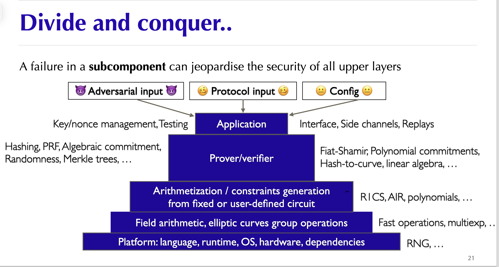

# Awesome zero knowledge proofs security
 A curated list of awesome things related to learning zero knowledge proofs security

## Table of Content
- [Table of Content](#table-of-content)
- [1. Introduction](#1-introduction)
- [2. Vulnerability Classification](#2-vulnerability-classification)
  - [Architectureal Design Flaws](#architectureal-design-flaws)
  - [FrontEnd: Circuits](#frontend-circuits)
    - [Soundness Error (Under-constrained)](#soundness-error-under-constrained)
    - [Completeness Error (Over-constrained)](#completeness-error-over-constrained)
    - [Zero Knowledge Error](#zero-knowledge-error)
  - [Misc: Witness Generation \& Arithemtization](#misc-witness-generation--arithemtization)
  - [BackEnd: Proving system](#backend-proving-system)
- [3. Security Consideration](#3-security-consideration)
  - [circom](#circom)
  - [cairo](#cairo)
- [4. Learning Resources](#4-learning-resources)
  - [Books \& Docs](#books--docs)
  - [Papers](#papers)
  - [Blogs](#blogs)
    - [Worth a look](#worth-a-look)
    - [Resources](#resources)
  - [Videos](#videos)
  - [Audit Reports](#audit-reports)
  - [Tools](#tools)
  - [zkHACK/CTF/Puzzles](#zkhackctfpuzzles)
  - [Miscellaneous](#miscellaneous)
- [Acknowledgements](#acknowledgements)

## 1. Introduction

[Zero Knowledge Proof (ZKP)](https://github.com/matter-labs/awesome-zero-knowledge-proofs) technology is considered as a very promising infrastructure in blockchain field, even not limited to the Web3 world.

In concept, proving system (or proof system in some context) are indeed advanced cryptographic techniques as you can see in various papers. But when it comes to a ZK application, from a development perspective, it is usually divided into two parts: front-end and back-end.

In general, ZKP is a technique for proving the correct execution of programs, which has completeness, soundness, and zero knowledge property. Specifically, the front-end is these programs that can be proven, namely circuits that implement computation logic, while the back-end is a proving system used to generate proof for the execution of these logic. 

As with other programming field, the primary technical risk faced by both is code bugs.

I strongly recommand everyone to learn ZK Security from the perspective of zkapp. The following figure from [Aumasson'slides](https://www.aumasson.jp/data/talks/zksec_zk7.pdf) which provide us with a good layered display.

To be more precise, circuits implementation comes with its own set of vulnerability classification, disjoint from the low-level cryptography bugs that may be found in the proving system.

## 2. Vulnerability Classification

The mental models of circuits (or constraints) are very different from traditional programming, programmers should be very careful about it. 

While the programming approach of zkVM programs is more similar to traditional programming (but not exactly the same because the underlying VM is implemented as circuits, so only some circuit friendly operations can be implemented, such as hash functions [pedersen](https://iden3-docs.readthedocs.io/en/latest/iden3_repos/research/publications/zkproof-standards-workshop-2/pedersen-hash/pedersen.html#pdf-link), [poseidon](https://eprint.iacr.org/2019/458.pdf), and [MiMC](https://eprint.iacr.org/2016/492.pdf), so the learning threshold and cost are lower. **The underlying of zkVM is essentially circuits**.

The emergence of zkVM (including zkEVM) has greatly enriched the application of zk technology, and people can prove more diverse programs, such as smart contracts (starknet based on [cairo VM](https://github.com/lambdaclass/cairo-vm), blockchain based on various EVMs such as [Polygon](https://docs.polygon.technology/zkEVM/), [Scroll](https://scroll.io/blog/zkevm), [zksync](https://github.com/matter-labs/zksync-era), etc.) and general programs ([RISC Zero](https://dev.risczero.com/api/zkvm/), [SP1](https://github.com/succinctlabs/sp1), etc.) . 

Meanwhile, it also aligns with many traditional programming fields, such as reverse engineering (A CTF [puzzle](https://github.com/weikengchen/zkctf-r0-season1) by [weikeng chen](https://github.com/weikengchen/))。

Therefor, the scope of programs above zkVM is much boarder, including smart contracts ([Solidity](https://soliditylang.org/), [Cairo](https://www.cairo-lang.org/)) and other traditional programs, which security will not be discussed here for now.

### Architectureal Design Flaws

- [Front Running](./Architectural%20Design%20Flaws/Front-Running.md)

### FrontEnd: Circuits

#### Soundness Error (Under-constrained)

Missing constraints or under-constrained is the most common bug in zk circuits, which occurs when a system, **fails to enforce necessary limitations or conditions** on inputsor operations. This could be due to absent validation checks, insufficient boundary enforcement, or improper assumptions about input data. As a result, users or attackers can manipulate or bypass expected behavior, leading to unintended consequences, security issues, or data corruption. 

it is a very generalized type of bug, and we divide it into 4 sub issues and give our reason:

- [General Logic](./Circuits%20Bugs/Soundness/General%20Logic%20Bug.md)
- [Arithmetic Over/Under Flow](./Circuits%20Bugs/Soundness/Arithmetic%20Over%20or%20Under%20Flow.md)
- [Mismatched Types/Lengths](./Circuits%20Bugs/Soundness/Mismatched%20Type%20or%20Length.md)
- [Non-determinism](./Circuits%20Bugs/Soundness/Non-determinism.md)
- [Assigned but not Constrained](./Circuits%20Bugs/Soundness/Assigned%20but%20not%20constrained.md)
- [Compiler Optimization](./Circuits%20Bugs/Soundness/Compiler%20Optimization.md)

#### Completeness Error (Over-constrained)

- not much
  
#### Zero Knowledge Error

- [Trusted Setup Leak](./Circuits%20Bugs/Zero-Knowledge/Trusted%20Setup%20Leak.md)
- [Bad Protocol Design/Implementation](./Circuits%20Bugs/Zero-Knowledge/Bad%20Protocol%20Design\Impl.md)

### Misc: Witness Generation & Arithemtization

Worth further exploring.

### BackEnd: Proving system

The backend is the proving system that leans towards the cryptographic part, so this part involves more secure applications of cryptographic primitives. One must note: **even secure primitives may introduce vulnerabilities if used incorrectly in the larger protocol or configured in an insecure manner**. 

To sum up, most vulnerabilities of proving system are **Unstandardized Cryptographic Implementation**.

- [Frozen Heart]()
- [Lack of Domain Seperation]()
- [Bad Polynomial Implementation]()
- [Missing Curve Point check]()
- [Unseure Hash Function]()

## 3. Security Consideration

### circom

- [blockdev's slides](https://hackmd.io/@blockdev/Bk_-jRkXa#/)
- [Best Practices for Large Circom Circuits](https://hackmd.io/V-7Aal05Tiy-ozmzTGBYPA?view)

### cairo

1. No payable functions
2. Name hashed storage slots
3. Upgradeability built-in
4. Separated internal/external functions
5. Cheap execution means readable algorithms
6. Immutable variables by default
7. Safe type conversions
8. Option and Result traits

**Reference**
- [starknet book](https://book.starknet.io/ch02-14-security-considerations.html)
- [cairo-the-starknet-way-to-writing-safe-code by Nethermind Security](https://medium.com/nethermind-eth/cairo-the-starknet-way-to-writing-safe-code-8169486c7132)

## 4. Learning Resources

### Books & Docs

- [Proofs, Arguments, and Zero-Knowledge (PAZK)](https://people.cs.georgetown.edu/jthaler/ProofsArgsAndZK.pdf) by Thaler.
- [Hash-based SNARGs-Book](https://github.com/hash-based-snargs-book/hash-based-snargs-book/blob/main/snargs-book.pdf) by Alessandro Chiesa and Eylon Yogev.
- [ZKDocs](https://www.zkdocs.com/) by [Trail of Bits](https://www.trailofbits.com/)
- [The RareSkills Book of Zero Knowledge](https://www.rareskills.io/zk-book) Not fully disclosed :(

### Papers

- [SoK: What Don’t We Know? Understanding Security Vulnerabilities in SNARKs](https://arxiv.org/pdf/2402.15293)
- [CirC: Compiler infrastructure for proof systems, software verification, and more](https://github.com/circify/circ/)
- [Weak Fiat-Shamir Attacks on Modern Proof Systems](https://eprint.iacr.org/2023/691.pdf)
- [On the practical CPAD security of “exact” and threshold FHE schemes and libraries](https://eprint.iacr.org/2024/116)
- [Attacks Against the INDCPA-D Security of Exact FHE Schemes](https://eprint.iacr.org/2024/127)
- [Automated Analysis of Halo2 Circuits](https://ceur-ws.org/Vol-3429/paper3.pdf)

### Blogs

#### Worth a look

- [Endeavors into the zero-knowledge Halo2 proving system](https://consensys.io/diligence/blog/2023/07/endeavors-into-the-zero-knowledge-halo2-proving-system/#:~:text=How%20can%20bugs%20happen%20in%20Halo2%20circuits%3F) by Consensys Diligence
- [Frozen Heart](https://blog.trailofbits.com/2022/04/13/part-1-coordinated-disclosure-of-vulnerabilities-affecting-girault-bulletproofs-and-plonk/) by Trail of bits.
- [Two Vulnerabilities in gnark's Groth16 Proofs](https://www.zellic.io/blog/gnark-bug-groth16-commitments/) by Zellic.

#### Resources

- [0xPARC Blog](https://0xparc.org/blog)
- [zkHACK Blog](https://zkhack.dev/blog/)
- [NCC Group Research Blog](https://research.nccgroup.com/)
- [Zellic Blog](https://www.zellic.io/blog/)
- [zkSecurity Blog](https://www.zksecurity.xyz/blog/)
- [Rot256 Blog](https://rot256.dev/)
- [David Wong Blog](https://www.cryptologie.net/)
- [LambdaClass Blog](https://blog.lambdaclass.com/)
- [Nethermind Blog](https://www.nethermind.io/blogs)
- [Ingonyama Blog](https://www.ingonyama.com/blog)
- [Open Zeppelin Blog](https://blog.openzeppelin.com/)
- [samczsum Blog](https://samczsun.com/)
- [Xor0v0 Blog](https://xor0v0.github.io/ZK-Puzzle-Writeups/)

### Videos

- [Introduction to ZK Security Research](https://www.youtube.com/watch?v=P2OVtcsSZSQ)  by David Theodore from EF. This classification of bugs in zk-circuits is widely accepted.
- [zBlock1](https://yacademy.dev/fellowships/zBlock1) by yAcademy. 「Very worth a look!!」 
### Audit Reports

- [ZK Related Security Reviews](https://github.com/nullity00/zk-security-reviews) of ZK Protocols by [nullity](https://github.com/nullity00). Consists of Security Reports of 50+ ZK Protocols.
- [code4rena Report](https://code4rena.com/reports)

You can directly visit the [solodit](https://solodit.xyz/) website to get some off-the-shelf audit reports.

If you are intereted in security about zkVM programs, here are some audit material about smart contract.

Solidity: 
  - [Solidity Security Blog](https://github.com/sigp/solidity-security-blog)
  - [not-so-smart-contract](https://github.com/crytic/not-so-smart-contracts)
  - [List of Security Vunerabilities](https://github.com/runtimeverification/verified-smart-contracts/wiki/List-of-Security-Vulnerabilities)

Cairo: 
  - [Opus-2024_01-c4](https://code4rena.com/reports/2024-01-opus#h-01-neglect-of-exceptional-redistribution-amounts-in-withdraw_helper-function)
  - [lindy-labs-aura-2023_11-tob](https://solodit.xyz/issues/healthy-loans-can-be-liquidated-trailofbits-none-lindy-labs-aura-pdf)
  - [Argent-Account-2023_6-consensys](https://consensys.io/diligence/audits/2023/06/argent-account-multisig-for-starknet/)

### Tools
| Tool | Technique | UC	| OC | CE |
| - | - | - | - | - | 
| Circomspect | SA | ✓ | ✗ | ✗ |
| ZKAP | SA	| ✓	| ✗	| ✗ |
| halo2-analyzer | SA | ✓	| ✓ |	✗ |
| Coda | FV	| ✓	| ✓	| ✓ |
| Ecne | FV | ✓ |	✗ | ✗ |
| Picus | FV | ✓ | ✗ | ✗ |
| Aleo | FV | ✓ | ✓ | ✓ |
| SnarkProbe | DA | ✓ |	✓	| ✗ |
| CIVER|FV|✓|✗|✗ |
| GNARK/Lean | FV | ✓ | ✓	| ✓ |

### zkHACK/CTF/Puzzles

- [zkHACKs](https://zkhack.dev/)
- [Paradigm CTF](https://ctf.paradigm.xyz/)
- [Paradigm CTF Infrastructure](https://github.com/paradigmxyz/paradigm-ctf-infrastructure)
- [Open Zeppelin CTF](https://ctf.openzeppelin.com/)
- [Ingonyama CTF](https://ctf.ingonyama.com/)
- [RareSkill ZK Puzzles](https://github.com/RareSkills/zero-knowledge-puzzles/tree/main)
- [cairo-damn-vulnerable](https://github.com/credence0x/cairo-damn-vulnerable-defi)
- [starknet-security-challenges.app](https://starknet-security-challenges.app/)
- [StarknetCC-CTF](https://github.com/pscott/StarknetCC-CTF)

writeups

- [2023 Ingonyama CTF WP by shuklaayush](https://hackmd.io/@shuklaayush/SkWizdyBh)
- [2023 Ingonyama CTF Official WP](https://github.com/ingonyama-zk/zkctf-2023-writeups)

### Miscellaneous

- ["Security of ZKP projects: same but different"](https://www.aumasson.jp/data/talks/zksec_zk7.pdf) by JP Aumasson @ [Taurus](https://www.taurushq.com/). Great slides outlining the different types of zk security vulnerabilities along with examples.
- [0xPARC zk-bug-tracker](https://github.com/0xPARC/zk-bug-tracker) by [0xPARC](https://0xparc.org/) and [PSE](https://pse.dev/).
- BUG Bounty platform: [code4rena](https://code4rena.com/), [Immunefi](https://immunefi.com/).
- [l2-security-framework by QuantStamp](https://github.com/quantstamp/l2-security-framework)

## Acknowledgements

Special thanks go to the following individuals and organizations for their ongoing support and encouragement: [Nullity](https://nullity00.github.io/).
